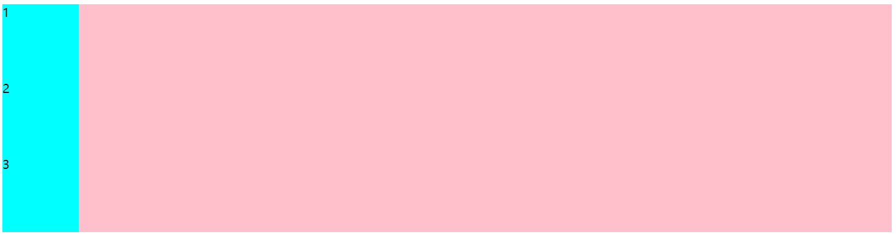
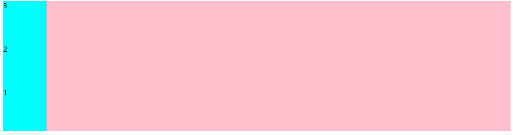
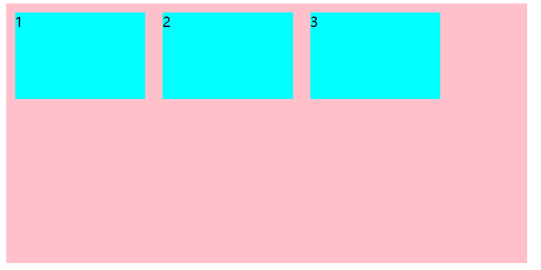
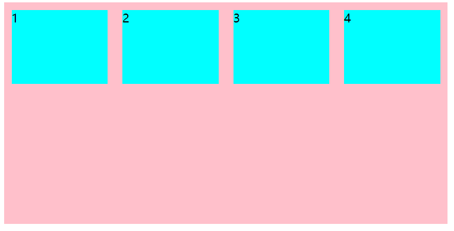
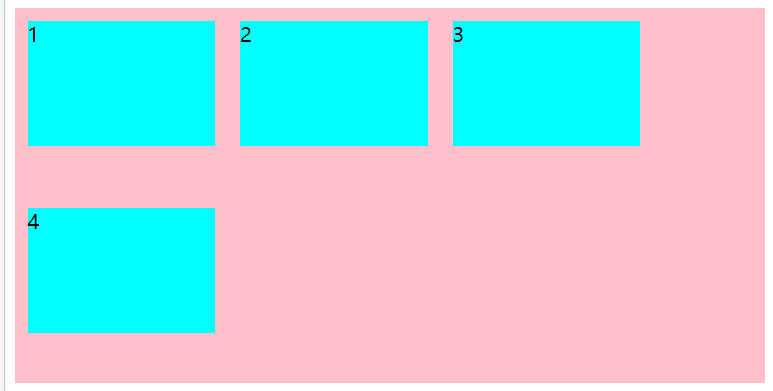
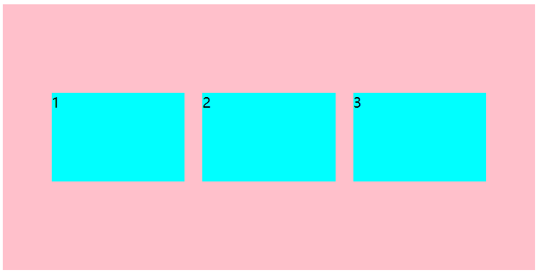
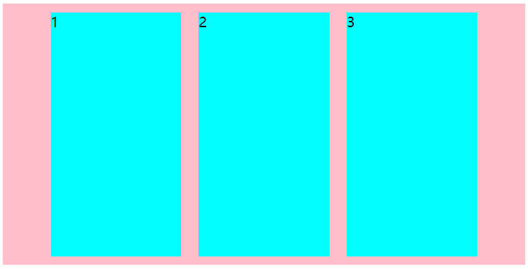
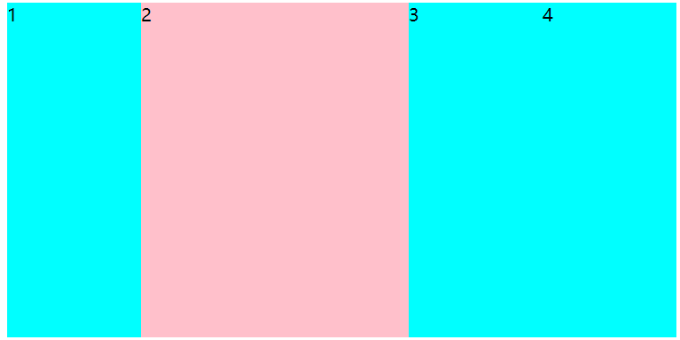

# flex布局

## 1.体验flex布局

```html
<!DOCTYPE html>
<html lang="en">
<head>
    <meta charset="UTF-8">
    <title>Title</title>
    <style>
        div {
            /*给父元素添加flex元素*/
            display: flex;
            width: 80%;
            height: 300px;
            background: pink;
        }

        div span {
            width: 100px;
            height: 150px;
            background: aqua;
            margin-right: 5px;
        }
    </style>
</head>
<body>
    <div>
        <span>1</span>
        <span>2</span>
        <span>3</span>
    </div>
</body>
</html>
```


## 2.flex布局的原理

### 2.1 flex的描述

- flex是flexible Box的缩写，意为弹性布局，用来为盒状模型提供最大的灵活性，任何一个容器都可以指定为flex布局
- 在使用了flex布局之后，就不分块状元素和行内元素。**浮动效果也就不生效**

### 2.2 布局原理

采用flex布局的元素(display：flex)，称为flex容器，简称“容器”。它的所有子元素自动成为容器成员，成为flex项目

- 体验中的div就是flex容器
- 体验中的span就是flex项目
- 项目可以在容器中自由指定排列的方式

## 2.3 常见的父项属性

### 2.3.1 flex-direction

**<font color='orange'>描述</font>**：flex-direction是控制项目在容器中的主轴方向，主轴方向可以有水平向右（默认）、水平向左、垂直向上、垂直向下

- **flex-direction: row;** (水平向右)

- ```html
  <style>
      div {
          /*给父元素添加flex元素*/
          display: flex;
          width: 80%;
          height: 300px;
          background: pink;
  
          /*默认的主轴为水平向右*/
          flex-direction: row;
      }
  
      div span {
          width: 100px;
          height: 150px;
          background: aqua;
          margin-right: 5px;
      }
  </style>
  ```

- 

---

- **flex-direction：row-reverse;** (主轴为水平向左)

- ```html
  <style>
      div {
          /*给父元素添加flex元素*/
          display: flex;
          width: 80%;
          height: 300px;
          background: pink;
  
          /*主轴为水平向左*/
          flex-direction: row-reverse;
      }
  
      div span {
          width: 100px;
          height: 150px;
          background: aqua;
          margin-right: 5px;
      }
  </style>
  ```

- 

---

- **flex-direction: column;**  (主轴为垂直向下)

- ```html
  <style>
      div {
          /*给父元素添加flex元素*/
          display: flex;
          width: 80%;
          height: 300px;
          background: pink;
  
          /*主轴为垂直向下*/
          flex-direction: column;
      }
  
      div span {
          width: 100px;
          height: 150px;
          background: aqua;
          margin-right: 5px;
      }
  </style>
  ```

- 

---

- **flex-direction:  column-reverse;** (主轴为垂直向上)

- ```html
  <style>
      div {
          /*给父元素添加flex元素*/
          display: flex;
          width: 80%;
          height: 300px;
          background: pink;
  
          /*主轴为垂直向上*/
          flex-direction: column-reverse;
      }
  
      div span {
          width: 100px;
          height: 150px;
          background: aqua;
          margin-right: 5px;
      }
  </style>
  ```

- 

### 2.3.2 justify-content

<font color='orange'>**描述**</font>：justify-content表示在主轴方向上的对齐方式**(**它表示的是在主轴方向上的对齐方式类似居中、左对齐...与主轴的方向不是一回事**)**

- ```html
  /*从主轴开始方向对齐*/
  justify-content: flex-start;
  ```

- ```
  /*从主轴末端方向对齐*/
  justify-content: flex-end;
  ```

- ```
  /*以主轴居中对齐*/
  justify-content: center;
  ```

- ```
  /*平分主轴对齐*/
  justify-content: space-around;
  ```

- ```
  /*先铺平两侧在平分主轴对齐  (重要)*/
  justify-content: space-around;
  ```

### 2.3.3 flex-wrap

<font color='orange'>**描述**</font>：在 flex布局中默认情况下，所有的项目都是排在一条线上的。flex-wrap可以调整是否换行

- ```
  /*不换行(默认)*/
  flex-wrap: nowrap;
  ```

- ```
  /*换行*/
  flex-wrap: wrap;
  ```

<font color='orange'>**演示**</font>：

1. 再加一个项目就会超过容器的width

   

2. 再加一个项目不会换行而是会动态调整项目的大小，使之在一条轴线上

   

3. 在容器上添加flex-wrap: wrap之后

   

### 2.3.4 align-items

<font color='orange'>**描述**</font>：align-items表示侧轴的对齐方式(如果主轴是水平那么侧轴就是垂直，只适用于单行)

<font color='orange'>**演示**</font>：实现居中对齐

```html
/*默认主轴为水平向左*/
flex-direction: row;
/*主轴的对齐方式为居中*/
justify-content: center;
/*侧轴的对齐方式为居中对齐*/
align-items: center;
```



- ```
  /*侧轴的对齐方式为侧轴开始方向*/
  align-items: flex-start;
  ```

- ```
  /*侧轴的对齐方式为侧轴末端方向*/
  align-items: flex-end;
  ```

- ```
  /*侧轴的对齐方式为居中对齐*/
  align-items: center;
  ```

- ```
  /*侧轴的对齐方式为拉伸(填充侧轴，项目在侧轴方向上的width或height不能设置为固定值)*/
  align-items: stretch;
  ```

  拉伸效果

  

## 2.4 常见的子项属性

### 2.4.1 flex

<font color='orange'>**描述**：</font>项目中的flex属性表示这个项目在容器中占多少份

<font color='orange'>**演示：**</font>

```css
div span {
    background: aqua;
    /*表示每个项目之战一份*/
    flex: 1;
}
div span:nth-child(2) {
    background: pink;
    /*表示第二个项目占两份*/
    flex: 2;
}
```



### 2.4.2 align-self

<font color='orange'>**描述：**</font>它表示子项目在侧轴的排列顺序，与align-items不同它是在子项目上指定某个特定的项目在侧轴上排列的顺序

<font color='orange'>**使用：**</font>使用方式与alige-items相同