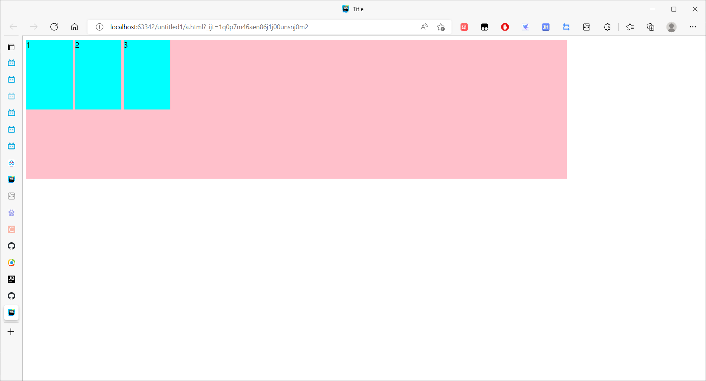
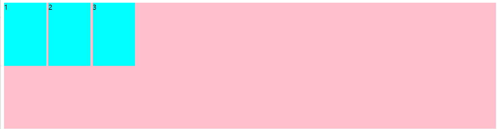
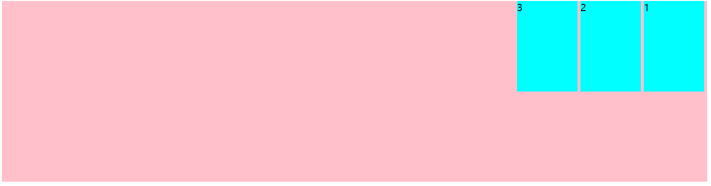

# flex布局

## 1.体验flex布局

```html
<!DOCTYPE html>
<html lang="en">
<head>
    <meta charset="UTF-8">
    <title>Title</title>
    <style>
        div {
            /*给父元素添加flex元素*/
            display: flex;
            width: 80%;
            height: 300px;
            background: pink;
        }

        div span {
            width: 100px;
            height: 150px;
            background: aqua;
            margin-right: 5px;
        }
    </style>
</head>
<body>
    <div>
        <span>1</span>
        <span>2</span>
        <span>3</span>
    </div>
</body>
</html>
```



## 2.flex布局的原理

### 2.1 flex的描述

- flex是flexible Box的缩写，意为弹性布局，用来为盒状模型提供最大的灵活性，任何一个容器都可以指定为flex布局
- 在使用了flex布局之后，就不分块状元素和行内元素。**浮动效果也就不生效**

### 2.2 布局原理

采用flex布局的元素(display：flex)，称为flex容器，简称“容器”。它的所有子元素自动成为容器成员，成为flex项目

- 体验中的div就是flex容器
- 体验中的span就是flex项目
- 项目可以在容器中自由指定排列的方式

## 2.3 常见的父项属性

### 2.3.1 flex-direction

**<font color='orange'>描述</font>**：flex-direction是控制项目在容器中的排列方式，排列方式可以有水平向右（默认）、水平向左、垂直向上、垂直向下

- **flex-direction: row;** (水平向右)

- ```html
  <style>
      div {
          /*给父元素添加flex元素*/
          display: flex;
          width: 80%;
          height: 300px;
          background: pink;
  
          /*默认的主轴为水平向右*/
          flex-direction: row;
      }
  
      div span {
          width: 100px;
          height: 150px;
          background: aqua;
          margin-right: 5px;
      }
  </style>
  ```

- 

---

- **flex-direction：row-reverse;** (主轴为水平向左)

- ```html
  <style>
      div {
          /*给父元素添加flex元素*/
          display: flex;
          width: 80%;
          height: 300px;
          background: pink;
  
          /*主轴为水平向左*/
          flex-direction: row-reverse;
      }
  
      div span {
          width: 100px;
          height: 150px;
          background: aqua;
          margin-right: 5px;
      }
  </style>
  ```

- 