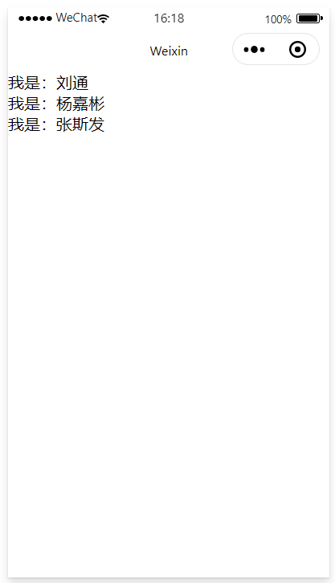

# 微信小程序

## 1. 初识小程序

### 1.1 小程序项目的基本构成


- **pages**：用来存放所有小程序的页面
- **utils**：用来存放工具性质的模块
- **app.js**：小程序项目的入口文件
- **app.json**：小程序项目的全局配置文件
- **app.wxss**：小程序项目的全局样式配置文件
- **project.config.json**：项目的配置文件
- **sitemap.json**：用来配置小程序及其页面是否允许被微信索引

### 1.2 小程序页面的组成部分


描述：每个页面由四个基本文件组成他们分别是：

1. **.js文件**：页面的脚本文件，存放页面的数据，时间处理函数等
2. **.json文件**：当前页面的配置文件，配置窗口的外观、表现等
3. **.wxml文件**：页面的模板结构文件
4. **.wxss文件**：当前页面的样式表文件

## 2.组件

### 2.1 简介

**描述**：微信小程序中的组件与HTML中的标签类似，是由微信作为宿主环境，开发者可以快速搭建出漂亮的页面。

**分类**：

1. 视图容器
2. 基础内容
3. 表单组件
4. 导航组件
5. 媒体组件
6. map地图组件
7. canvas画布组件
8. 开放能力
9. 无障碍访问

### 2.2 常用组件

1. **view**

   - 普通视图区域
   - 类似于HTML中的div，是一个块级元素
   - 常用于实现页面的布局效果
   - 展示：

   ```html
   <view class="container">
     <view>1</view>
     <view>2</view>
     <view>3</view>
   </view>
   ```

   ```css
   .container view {
        width: 50px;
        height: 50px;
        text-align: center;
        line-height: 50px;
   }
   .container view:nth-child(1) {
     background-color: pink;
   }
   .container view:nth-child(2) {
     background-color: blue;
   }
   .container view:nth-child(3) {
     background-color: red;
   }
   
   .container {
     display: flex;
     flex-direction: row;
     justify-content: space-around;
   }
   ```

   

2. **scroll-view**

   - 可滚动的视图区域
   - 常用来实现可滚动的列表效果
   - 展示：

   ```html
   <!-- scroll-y表示滚动组件是y轴方向的 -->
   <scroll-view class="container1" scroll-y>
     <view>1</view>
     <view>2</view>
     <view>3</view>
   </scroll-view>
   ```

   ```css
   /* pages/list/list.wxss */
   .container1 view {
        width: 100px;
        height: 100px;
        text-align: center;
        line-height: 50px;
   }
   .container1 view:nth-child(1) {
     background-color: pink;
   }
   .container1 view:nth-child(2) {
     background-color: blue;
   }
   .container1 view:nth-child(3) {
     background-color: red;
   }
   
   .container1 {
     border: 1px solid black;
     width: 100px;
     /*Y轴的滚动条一定要设置height才能出现滚动的效果*/
     height: 150px;
   }
   ```

   

3. **swiper**和**swiper-item**

   - 轮播图容器组件和轮播图item组件

   - 组件的属性：

     

   

   - 展示：

   ```html
   <!-- 轮播图容器 -->
   <swiper class="swiper-container" indicator-dots>
     <!-- 第一个轮播图项目 -->
     <swiper-item>
       <view class="item">A</view>
     </swiper-item>
     <!-- 第二个轮播图项目 -->
     <swiper-item>
       <view class="item">B</view>
     </swiper-item>
     <!-- 第三个轮播图项目 -->
     <swiper-item>
       <view class="item">C</view>
     </swiper-item>
   </swiper>
   ```

   ```css
   .swiper-container {
     height: 150px;
   }
   
   .item {
     border: 1px solid red;
     height: 100%;
     line-height: 150px;
     text-align: center;
   }
   swiper-item:nth-child(1) {
     background-color: pink;
   }
   swiper-item:nth-child(2) {
     background-color: orange;
   }
   swiper-item:nth-child(3) {
     background-color: blue;
   }
   ```

   

4. **text**

   - 文本组件

   - 类似于HTML中的span标签，是一个行内元素

   - 展示：

     ```html
     <!-- text为行内元素，设置selecable属性表示长按可以复制 -->
     <text selectable="true">长按可以复制</text>
     <text>啊啊啊啊</text>
     ```

     

     

5. rich-text

   - 富文本组件
   - 支持把HTML字符串渲染成WXML结构

   - 展示：

     ```html
     <rich-text nodes="<h1>我是HTML的h1标签</h1>"></rich-text>
     ```

     

6. button

   - 按钮组件

   - 功能比HTML中的button更丰富

   - 通过open-type属性可以调用微信提供的各种功能(客服、转发、获取用户授权、获取用户信息)

   - 展示：

     ```html
     <!-- 通过type指定按钮的颜色 -->
     <button>普通按钮</button>
     <button type="primary">主色调按钮</button>
     <button type="warn">警告按钮</button>
     <view>-----------------------------------------</view>
     <!-- 通过size属性控制按钮大小 -->
     <button size="mini" type="primary">小按钮</button>
     <view>-----------------------------------------</view>
     <!-- plain镂空按钮 -->
     <button type="primary" plain>镂空按钮</button>
     ```

     

7. image

   - 图片组件

   - image组件的默认宽度为300px，高度240px

   - 展示：

     ```html
     <image></image>
     <image src="./image/1.jpeg"></image>
     ```

     

8. navigator

   - 页面导航组件
   - 类似与HTML中的a链接

## 3. 模板与配置

### 3.1 WXML 模板语法

#### 3.1.1 数据绑定 

1. 数据绑定的基本原则

   - 在data中定义数据
   - 在WXML中使用数据

2. 在data中定义页面的数据

   - 在页面对应的.js文件中，把数据定义到data对象中即可

     ```javascript
     Page({
     
       /**
        * 页面的初始数据
        */
       data: {
         info: "hello world",
         imgSrc : "./image/1.jpeg"
       },
     })
     ```

3. mustache语法

   - 把data中的数据绑定到页面中进行渲染，使用mustache语法(双大括号)将变量包起来即可

     ```html
     <view>{{info}}</view>
     ```

     

4.mustache语法的应用场景如下：

- 绑定内容
- 绑定属性
- 运算(算数运算、三元运算等)

5. 动态绑定属性

   - 直接在属性等号右边使用mustache语法即可(不需要像vue一样使用v-bind)

     ```html
     <image src="{{imgSrc}}" mode="widthFix"></image>
     ```

     

6. mustache语法内可运算

   - 在mustache语法中可以进行各种运算

     ```javascript
     Page({
     
       /**
        * 页面的初始数据
        */
       data: {
         num : 10
       }
     })
     ```

     ```html
     <view>10 + 1 = {{num + 1}}</view>
     ```

     

7. 在小程序调试器的appData中可以查看页面中的data数据

   

#### 3.1.2 事件绑定

1.  什么是事件？

   事件是**渲染层到逻辑层的通讯方式**，通过事件可以将用户在渲染层产生的行为，反馈到逻辑层进行业务处理。

2. 小程序中常用的事件

   

3. 事件对象的属性列表

   

   tips：target 是触发该事件的源头组件，而 currentTarget 则是当前事件所绑定的组件。点击内部的按钮时，点击事件以冒泡的方式向外扩散，也会触发外层 view 的 tap 事件处理函数。

4. bindtap的语法格式

   - 通过bindtap，可以为组件绑定tap触摸事件

     ```html
     <button type="primary" bindtap="testTap">按钮</button>
     ```

   - 在对应页面的.js文件中定义事件处理函数，事件参数通过形参event(一般简写成e)来接收

     ```javascript
     Page({
       // testTap()
       testTap(e) {
         console.log(e)
       }
     })
     ```

     

5. 在事件处理函数中为data中的数据赋值

   - 通过调用this.setData(dataObject)方法

     ```javascript
     Page({
     
       /**
        * 页面的初始数据
        */
       data: {
         num : 10,
         num2 : 100
       },
       // tap1()
       testTap(e) {
         this.setData({
           num : this.data.num + 1,
           num2 : this.data.num2 + 2
         })
       }
     })
     ```

     

6. 事件传参

   - star:小程序的事件传参比较特殊，**不能在事件绑定的同时为事件处理函数传递参数**，例如：

     ```html
     <!-- 这样是无法传递参数的，事件绑定只有一个参数就是事件对象 -->
     <button type="primary" bindtap="testTap(666)">按钮</button>
     ```

   - 正确的传参方式是在组件的属性中添加一个data-*=""，\*代表任意参数的名字，会在事件对象中的event.target.dataset.\*中

     ```html
     <!-- 正确的传参方式为添加一个属性data-* -->
     <button type="primary" bindtap="testTap" data-info="{{666}}">按钮</button>
     ```

     ```javascript
     Page({
     
       // 在事件对象中可以拿到info参数的数据
       testTap(e) {
         console.log(e.target.dataset.info)
       }
     })
     ```

     

7. bindinput语法格式

   - 在小程序中通过**input事件**来响应小程序的文本框输入事件

     ```html
     <!-- 通过bindinput为文本框绑定输入事件 -->
     <input bindinput="inputHandler"></input>
     ```

     ```javascript
     Page({
       // e.detail.value可以获取input事件发生改变之后的值
       inputHandler(e) {
         console.log(e.detail.value)
       }
     })
     ```

     

     

#### 3.1.3 条件渲染

1. wx:if

   - 在小程序中使用wx:if判断元素是否需要被渲染(与vue中的v-if类似)

     ```html
     <view>性别：</view>
     <view wx:if="{{type === 1}}">男</view>
     <view wx:elif="{{type === 2}}">女</view>
     <view wx:else>保密</view>
     ```

     

2. 结合<block>使用wx:if

   - 如果需要一次性控制多个组件的展示与隐藏，可以使用<block>标签将多个组件包装起来

   - block标签不会被渲染在小程序页面上，

     ```html
     <block wx:if="{{type === 1}}">
       <view>微信小程序</view>
       <view>spring cloud</view>
     </block>
     ```

     

3. hidden

   - 在小程序中使用hidden属性也能控制组件的显示与隐藏

     ```html
     <view hidden="true">微信小程序</view>
     ```

4. wx:if与hidden的对比
   - wx:if以动态创建和移除元素的方式，控制元素的显示与隐藏
   - hidden以切换样式的方式(display:none/block)，控制元素的显示与隐藏
   - 频繁切换时，建议使用hidden
   - 控制条件复杂时，建议使用wx:if

#### 3.1.4 列表渲染

1. wx:for

   - 通过wx:for可以根据指定的数组，循环渲染组件的结构

     ```javascript
     Page({
       /**
        * 页面的初始数据
        */
       data: {
         array : ["Java", "Vue", "小程序"]
       }
     })
     ```

     ```html
     <!-- {{index}}表示循环的索引值，{{item}}表示数组中的数据 -->
     <view wx:for="{{array}}">
       索引：{{index}}，我爱：{{item}}
     </view>
     ```

     

2. wx:key

   - 类似于 Vue 列表渲染中的 **:key**，小程序在实现列表渲染时，也建议为渲染出来的列表项指定唯一的key 值，从而提高渲染的效率

     ```javascript
     Page({
     
       /**
        * 页面的初始数据
        */
       data: {
         array : [
           {id : 1, name : "刘通"},
           {id : 2, name : "杨嘉彬"},
           {id : 3, name : "张斯发"}
         ]
       }
     })
     ```

     ```html
     <!-- index也可以作为key -->
     <view wx:for="{{array}}" wx:key="id">
       我是：{{item.name}}
     </view>
     ```

     

### 3.2 WXSS模板样式

1. **什么是wxss？**

   - WXSS(Wei Xin Style Sheets)是一套样式语言，用于美化WXML组件样式，类似网页开发中的css

2. **wxss与CSS的关系**

   - WXSS 具有 CSS 大部分特性，同时，WXSS 还对 CSS 进行了扩充以及修改，以适应微信小程序的开发。

   - 与CSS 相比，WXSS 扩展的特性有：①**rpx 尺寸单位** ②**@import 样式导入**

3. **什么是rpx尺寸单位？**

   - **rpx**(responsive pixel)是微信小程序独有的，用来解决**屏幕适配**的尺寸单位

4. **rpx的实现原理**
   
- rpx的实现原理十分简单：鉴于不同设备二点屏幕设备的大小不同，为了实现屏幕的自动适配，rpx把所有设备的屏幕，在宽度上**等分为750份**(即当前屏幕的总宽度为750rpx)
   
5. **rpx与px之间的单位换算**

   

6. **样式导入**

   - 使用WXSS提供的**@import**语法，可以导入外联的样式表

   - @import后跟需要导入样式的相对路径即可

     ```
     @import "./common.wxss";
     ```

7. **全局样式和局部样式**
   - 全局样式是定义在app.wxss中的样式，作用于每一个页面
   - 局部样式只作用于当前页面
   - 当全局样式和局部样式冲突时，根据就近原则，局部样式会覆盖全局样式

### 3.3 全局配置

1. **全局配置文件及常用的配置项**

   小程序根目录下的app.json文件是小程序的全局配置文件。常用的配置项如下：

   ① pages：记录当前小程序所有页面的存放路径

   ②window：全局设置小程序的窗口外观

   ③tabBar：设置小程序底部的tabBar效果

   ④style：是否启用新版的组件样式

2. **window的配置**

   

3. **tabBar的配置**

   - tabBar是移动端应用常见的页面效果，用于实现多页面的快速切换

   - 小程序中通常分为顶部tabBar和底部tabBar

     

     

   - tabBar的六个组成部分

     ① backgroundColor：tabBar 的背景色

     ② selectedIconPath：选中时的图片路径

     ③ borderStyle：tabBar 上边框的颜色

     ④ iconPath：未选中时的图片路径

     ⑤ selectedColor：tab 上的文字选中时的颜色

     ⑥ color：tab 上文字的默认（未选中）颜色

     

   - tabBar的节点配置

     

   - 每个tabBar页签的配置

     

   - 应用实例

     ```json
     // app.json中配置tabBar
     {
       "pages": [
         "pages/home/home",
         "pages/message/message",
         "pages/contact/contact"    
       ],
       "window": {
         "backgroundTextStyle": "light",
         "navigationBarBackgroundColor": "#fff",
         "navigationBarTitleText": "Test",
         "navigationBarTextStyle": "black",
         "enablePullDownRefresh" : true
       },
       // 配置tabBar信息
       "tabBar": {
         "list": [
           {
             "pagePath": "pages/home/home",
             "text": "首页",
             "iconPath": "/images/tabs/home.png",
             "selectedIconPath": "/images/tabs/home-active.png"
           },
           {
             "pagePath": "pages/message/message",
             "text": "消息",
             "iconPath": "/images/tabs/message.png",
             "selectedIconPath": "/images/tabs/message-active.png"
           },
           {        
             "pagePath": "pages/contact/contact",
             "text": "联系我们",
             "iconPath": "/images/tabs/contact.png",
             "selectedIconPath": "/images/tabs/contact-active.png"        
           }
         ]
       },
       "style": "v2",
       "sitemapLocation": "sitemap.json",
       "lazyCodeLoading": "requiredComponents"
     }
     
     ```

4. **页面配置**

   - 小程序中，每个页面都有自己的.json文件，用来对当前窗口外观、页面效果等进行配置
   - 可以在每个页面的.json文件中，配置当前页面的window信息、

   - 配置选项与全局配置差不多

### 3.4 网络数据请求

 1. **网络数据请求限制**

    - 出于安全性方面的考虑，小程序官方对于数据接口请求做出了如下两个限制

      - 只能请求https类型的接口(测试阶段可以取消)

        

      - 必须将接口的**域名**添加到**信任列表**

2. **配置request合法域名**
   - 配置步骤：登录微信小程序管理后台->开发->开发设置->服务器域名->修改request合法域名
   - 注意事项：
     - 域名只支持https配置
     - 域名不能使用IP地址或者localhost
     - 域名必须经过ICP备案
     - 服务器域名一个月内最多可申请5次修改

3. **发起网络请求**

   - 调用微信提供的wx.request方法可以发起GET数据请求

     ```javascript
     // 在页面的.js文件中
     Page({
         
       getInfo() {
         wx.request({
           url: 'http://localhost:8111/user/hello',
           // 将method换成post即可变成post请求
           method: 'get',
           success: (res) => {
             console.log(res.data)
           }
         })
       }
     })
     ```

4. **在页面刚加载时请求数据**

   - 在很多情况下我们需要在页面刚加载时请求一些初始化的数据，此时可以在页面的onLoad事件中调用获取数据的函数

     ```javascript
     Page({
     
       getInfo() {
         wx.request({
           url: 'http://localhost:8111/user/hello',
           method: 'get',
           success: (res) => {
             console.log(res.data)
           }
         })
       },
     
       /**
        * 生命周期函数--监听页面加载
        */
       onLoad: function (options) {
         // 获取数据
         this.getInfo();
       }
     })
     ```

     