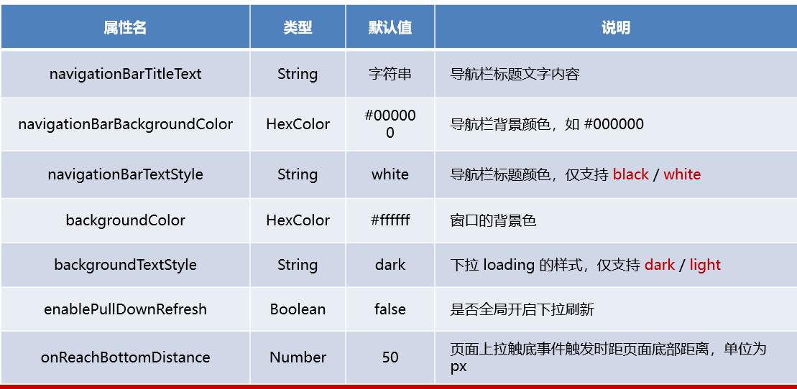
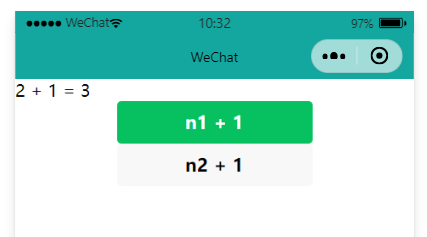

# 微信小程序

## 1. 初识小程序

### 1.1 小程序项目的基本构成


- **pages**：用来存放所有小程序的页面
- **utils**：用来存放工具性质的模块
- **app.js**：小程序项目的入口文件
- **app.json**：小程序项目的全局配置文件
- **app.wxss**：小程序项目的全局样式配置文件
- **project.config.json**：项目的配置文件
- **sitemap.json**：用来配置小程序及其页面是否允许被微信索引

### 1.2 小程序页面的组成部分


描述：每个页面由四个基本文件组成他们分别是：

1. **.js文件**：页面的脚本文件，存放页面的数据，时间处理函数等
2. **.json文件**：当前页面的配置文件，配置窗口的外观、表现等
3. **.wxml文件**：页面的模板结构文件
4. **.wxss文件**：当前页面的样式表文件

## 2.组件

### 2.1 简介

**描述**：微信小程序中的组件与HTML中的标签类似，是由微信作为宿主环境，开发者可以快速搭建出漂亮的页面。

**分类**：

1. 视图容器
2. 基础内容
3. 表单组件
4. 导航组件
5. 媒体组件
6. map地图组件
7. canvas画布组件
8. 开放能力
9. 无障碍访问

### 2.2 常用组件

1. **view**

   - 普通视图区域
   - 类似于HTML中的div，是一个块级元素
   - 常用于实现页面的布局效果
   - 展示：

   ```html
   <view class="container">
     <view>1</view>
     <view>2</view>
     <view>3</view>
   </view>
   ```

   ```css
   .container view {
        width: 50px;
        height: 50px;
        text-align: center;
        line-height: 50px;
   }
   .container view:nth-child(1) {
     background-color: pink;
   }
   .container view:nth-child(2) {
     background-color: blue;
   }
   .container view:nth-child(3) {
     background-color: red;
   }
   
   .container {
     display: flex;
     flex-direction: row;
     justify-content: space-around;
   }
   ```

   

2. **scroll-view**

   - 可滚动的视图区域
   - 常用来实现可滚动的列表效果
   - 展示：

   ```html
   <!-- scroll-y表示滚动组件是y轴方向的 -->
   <scroll-view class="container1" scroll-y>
     <view>1</view>
     <view>2</view>
     <view>3</view>
   </scroll-view>
   ```

   ```css
   /* pages/list/list.wxss */
   .container1 view {
        width: 100px;
        height: 100px;
        text-align: center;
        line-height: 50px;
   }
   .container1 view:nth-child(1) {
     background-color: pink;
   }
   .container1 view:nth-child(2) {
     background-color: blue;
   }
   .container1 view:nth-child(3) {
     background-color: red;
   }
   
   .container1 {
     border: 1px solid black;
     width: 100px;
     /*Y轴的滚动条一定要设置height才能出现滚动的效果*/
     height: 150px;
   }
   ```

   

3. **swiper**和**swiper-item**

   - 轮播图容器组件和轮播图item组件

   - 组件的属性：

     

   

   - 展示：

   ```html
   <!-- 轮播图容器 -->
   <swiper class="swiper-container" indicator-dots>
     <!-- 第一个轮播图项目 -->
     <swiper-item>
       <view class="item">A</view>
     </swiper-item>
     <!-- 第二个轮播图项目 -->
     <swiper-item>
       <view class="item">B</view>
     </swiper-item>
     <!-- 第三个轮播图项目 -->
     <swiper-item>
       <view class="item">C</view>
     </swiper-item>
   </swiper>
   ```

   ```css
   .swiper-container {
     height: 150px;
   }
   
   .item {
     border: 1px solid red;
     height: 100%;
     line-height: 150px;
     text-align: center;
   }
   swiper-item:nth-child(1) {
     background-color: pink;
   }
   swiper-item:nth-child(2) {
     background-color: orange;
   }
   swiper-item:nth-child(3) {
     background-color: blue;
   }
   ```

   

4. **text**

   - 文本组件

   - 类似于HTML中的span标签，是一个行内元素

   - 展示：

     ```html
     <!-- text为行内元素，设置selecable属性表示长按可以复制 -->
     <text selectable="true">长按可以复制</text>
     <text>啊啊啊啊</text>
     ```

     

     

5. rich-text

   - 富文本组件
   - 支持把HTML字符串渲染成WXML结构

   - 展示：

     ```html
     <rich-text nodes="<h1>我是HTML的h1标签</h1>"></rich-text>
     ```

     

6. button

   - 按钮组件

   - 功能比HTML中的button更丰富

   - 通过open-type属性可以调用微信提供的各种功能(客服、转发、获取用户授权、获取用户信息)

   - 展示：

     ```html
     <!-- 通过type指定按钮的颜色 -->
     <button>普通按钮</button>
     <button type="primary">主色调按钮</button>
     <button type="warn">警告按钮</button>
     <view>-----------------------------------------</view>
     <!-- 通过size属性控制按钮大小 -->
     <button size="mini" type="primary">小按钮</button>
     <view>-----------------------------------------</view>
     <!-- plain镂空按钮 -->
     <button type="primary" plain>镂空按钮</button>
     ```

     

7. image

   - 图片组件

   - image组件的默认宽度为300px，高度240px

   - 展示：

     ```html
     <image></image>
     <image src="./image/1.jpeg"></image>
     ```

     

8. navigator

   - 页面导航组件
   - 类似与HTML中的a链接

## 3. 模板与配置

### 3.1 WXML 模板语法

#### 3.1.1 数据绑定 

1. 数据绑定的基本原则

   - 在data中定义数据
   - 在WXML中使用数据

2. 在data中定义页面的数据

   - 在页面对应的.js文件中，把数据定义到data对象中即可

     ```javascript
     Page({
     
       /**
        * 页面的初始数据
        */
       data: {
         info: "hello world",
         imgSrc : "./image/1.jpeg"
       },
     })
     ```

3. mustache语法

   - 把data中的数据绑定到页面中进行渲染，使用mustache语法(双大括号)将变量包起来即可

     ```html
     <view>{{info}}</view>
     ```

     

4.mustache语法的应用场景如下：

- 绑定内容
- 绑定属性
- 运算(算数运算、三元运算等)

5. 动态绑定属性

   - 直接在属性等号右边使用mustache语法即可(不需要像vue一样使用v-bind)

     ```html
     <image src="{{imgSrc}}" mode="widthFix"></image>
     ```

     

6. mustache语法内可运算

   - 在mustache语法中可以进行各种运算

     ```javascript
     Page({
     
       /**
        * 页面的初始数据
        */
       data: {
         num : 10
       }
     })
     ```

     ```html
     <view>10 + 1 = {{num + 1}}</view>
     ```

     

7. 在小程序调试器的appData中可以查看页面中的data数据

   

#### 3.1.2 事件绑定

1.  什么是事件？

   事件是**渲染层到逻辑层的通讯方式**，通过事件可以将用户在渲染层产生的行为，反馈到逻辑层进行业务处理。

2. 小程序中常用的事件

   

3. 事件对象的属性列表

   

   tips：target 是触发该事件的源头组件，而 currentTarget 则是当前事件所绑定的组件。点击内部的按钮时，点击事件以冒泡的方式向外扩散，也会触发外层 view 的 tap 事件处理函数。

4. bindtap的语法格式

   - 通过bindtap，可以为组件绑定tap触摸事件

     ```html
     <button type="primary" bindtap="testTap">按钮</button>
     ```

   - 在对应页面的.js文件中定义事件处理函数，事件参数通过形参event(一般简写成e)来接收

     ```javascript
     Page({
       // testTap()
       testTap(e) {
         console.log(e)
       }
     })
     ```

     

5. 在事件处理函数中为data中的数据赋值

   - 通过调用this.setData(dataObject)方法

     ```javascript
     Page({
     
       /**
        * 页面的初始数据
        */
       data: {
         num : 10,
         num2 : 100
       },
       // tap1()
       testTap(e) {
         this.setData({
           num : this.data.num + 1,
           num2 : this.data.num2 + 2
         })
       }
     })
     ```

     

6. 事件传参

   - star:小程序的事件传参比较特殊，**不能在事件绑定的同时为事件处理函数传递参数**，例如：

     ```html
     <!-- 这样是无法传递参数的，事件绑定只有一个参数就是事件对象 -->
     <button type="primary" bindtap="testTap(666)">按钮</button>
     ```

   - 正确的传参方式是在组件的属性中添加一个data-*=""，\*代表任意参数的名字，会在事件对象中的event.target.dataset.\*中

     ```html
     <!-- 正确的传参方式为添加一个属性data-* -->
     <button type="primary" bindtap="testTap" data-info="{{666}}">按钮</button>
     ```

     ```javascript
     Page({
     
       // 在事件对象中可以拿到info参数的数据
       testTap(e) {
         console.log(e.target.dataset.info)
       }
     })
     ```

     

7. bindinput语法格式

   - 在小程序中通过**input事件**来响应小程序的文本框输入事件

     ```html
     <!-- 通过bindinput为文本框绑定输入事件 -->
     <input bindinput="inputHandler"></input>
     ```

     ```javascript
     Page({
       // e.detail.value可以获取input事件发生改变之后的值
       inputHandler(e) {
         console.log(e.detail.value)
       }
     })
     ```

     

     

#### 3.1.3 条件渲染

1. wx:if

   - 在小程序中使用wx:if判断元素是否需要被渲染(与vue中的v-if类似)

     ```html
     <view>性别：</view>
     <view wx:if="{{type === 1}}">男</view>
     <view wx:elif="{{type === 2}}">女</view>
     <view wx:else>保密</view>
     ```

     

2. 结合<block>使用wx:if

   - 如果需要一次性控制多个组件的展示与隐藏，可以使用<block>标签将多个组件包装起来

   - block标签不会被渲染在小程序页面上，

     ```html
     <block wx:if="{{type === 1}}">
       <view>微信小程序</view>
       <view>spring cloud</view>
     </block>
     ```

     

3. hidden

   - 在小程序中使用hidden属性也能控制组件的显示与隐藏

     ```html
     <view hidden="true">微信小程序</view>
     ```

4. wx:if与hidden的对比
   - wx:if以动态创建和移除元素的方式，控制元素的显示与隐藏
   - hidden以切换样式的方式(display:none/block)，控制元素的显示与隐藏
   - 频繁切换时，建议使用hidden
   - 控制条件复杂时，建议使用wx:if

#### 3.1.4 列表渲染

1. wx:for

   - 通过wx:for可以根据指定的数组，循环渲染组件的结构

     ```javascript
     Page({
       /**
        * 页面的初始数据
        */
       data: {
         array : ["Java", "Vue", "小程序"]
       }
     })
     ```

     ```html
     <!-- {{index}}表示循环的索引值，{{item}}表示数组中的数据 -->
     <view wx:for="{{array}}">
       索引：{{index}}，我爱：{{item}}
     </view>
     ```

     

2. wx:key

   - 类似于 Vue 列表渲染中的 **:key**，小程序在实现列表渲染时，也建议为渲染出来的列表项指定唯一的key 值，从而提高渲染的效率

     ```javascript
     Page({
     
       /**
        * 页面的初始数据
        */
       data: {
         array : [
           {id : 1, name : "刘通"},
           {id : 2, name : "杨嘉彬"},
           {id : 3, name : "张斯发"}
         ]
       }
     })
     ```

     ```html
     <!-- index也可以作为key -->
     <view wx:for="{{array}}" wx:key="id">
       我是：{{item.name}}
     </view>
     ```

     

### 3.2 WXSS模板样式

1. **什么是wxss？**

   - WXSS(Wei Xin Style Sheets)是一套样式语言，用于美化WXML组件样式，类似网页开发中的css

2. **wxss与CSS的关系**

   - WXSS 具有 CSS 大部分特性，同时，WXSS 还对 CSS 进行了扩充以及修改，以适应微信小程序的开发。

   - 与CSS 相比，WXSS 扩展的特性有：①**rpx 尺寸单位** ②**@import 样式导入**

3. **什么是rpx尺寸单位？**

   - **rpx**(responsive pixel)是微信小程序独有的，用来解决**屏幕适配**的尺寸单位

4. **rpx的实现原理**
   
- rpx的实现原理十分简单：鉴于不同设备二点屏幕设备的大小不同，为了实现屏幕的自动适配，rpx把所有设备的屏幕，在宽度上**等分为750份**(即当前屏幕的总宽度为750rpx)
   
5. **rpx与px之间的单位换算**

   

6. **样式导入**

   - 使用WXSS提供的**@import**语法，可以导入外联的样式表

   - @import后跟需要导入样式的相对路径即可

     ```
     @import "./common.wxss";
     ```

7. **全局样式和局部样式**
   - 全局样式是定义在app.wxss中的样式，作用于每一个页面
   - 局部样式只作用于当前页面
   - 当全局样式和局部样式冲突时，根据就近原则，局部样式会覆盖全局样式

### 3.3 全局配置

1. **全局配置文件及常用的配置项**

   小程序根目录下的app.json文件是小程序的全局配置文件。常用的配置项如下：

   ① pages：记录当前小程序所有页面的存放路径

   ②window：全局设置小程序的窗口外观

   ③tabBar：设置小程序底部的tabBar效果

   ④style：是否启用新版的组件样式

2. **window的配置**

   

3. **tabBar的配置**

   - tabBar是移动端应用常见的页面效果，用于实现多页面的快速切换

   - 小程序中通常分为顶部tabBar和底部tabBar

     

     

   - tabBar的六个组成部分

     ① backgroundColor：tabBar 的背景色

     ② selectedIconPath：选中时的图片路径

     ③ borderStyle：tabBar 上边框的颜色

     ④ iconPath：未选中时的图片路径

     ⑤ selectedColor：tab 上的文字选中时的颜色

     ⑥ color：tab 上文字的默认（未选中）颜色

     

   - tabBar的节点配置

     

   - 每个tabBar页签的配置

     

   - 应用实例

     ```json
     // app.json中配置tabBar
     {
       "pages": [
         "pages/home/home",
         "pages/message/message",
         "pages/contact/contact"    
       ],
       "window": {
         "backgroundTextStyle": "light",
         "navigationBarBackgroundColor": "#fff",
         "navigationBarTitleText": "Test",
         "navigationBarTextStyle": "black",
         "enablePullDownRefresh" : true
       },
       // 配置tabBar信息
       "tabBar": {
         "list": [
           {
             "pagePath": "pages/home/home",
             "text": "首页",
             "iconPath": "/images/tabs/home.png",
             "selectedIconPath": "/images/tabs/home-active.png"
           },
           {
             "pagePath": "pages/message/message",
             "text": "消息",
             "iconPath": "/images/tabs/message.png",
             "selectedIconPath": "/images/tabs/message-active.png"
           },
           {        
             "pagePath": "pages/contact/contact",
             "text": "联系我们",
             "iconPath": "/images/tabs/contact.png",
             "selectedIconPath": "/images/tabs/contact-active.png"        
           }
         ]
       },
       "style": "v2",
       "sitemapLocation": "sitemap.json",
       "lazyCodeLoading": "requiredComponents"
     }
     
     ```

4. **页面配置**

   - 小程序中，每个页面都有自己的.json文件，用来对当前窗口外观、页面效果等进行配置
   - 可以在每个页面的.json文件中，配置当前页面的window信息、

   - 配置选项与全局配置差不多

### 3.4 网络数据请求

 1. **网络数据请求限制**

    - 出于安全性方面的考虑，小程序官方对于数据接口请求做出了如下两个限制

      - 只能请求https类型的接口(测试阶段可以取消)

        

      - 必须将接口的**域名**添加到**信任列表**

2. **配置request合法域名**
   - 配置步骤：登录微信小程序管理后台->开发->开发设置->服务器域名->修改request合法域名
   - 注意事项：
     - 域名只支持https配置
     - 域名不能使用IP地址或者localhost
     - 域名必须经过ICP备案
     - 服务器域名一个月内最多可申请5次修改

3. **发起网络请求**

   - 调用微信提供的wx.request方法可以发起GET数据请求

     ```javascript
     // 在页面的.js文件中
     Page({
         
       getInfo() {
         wx.request({
           url: 'http://localhost:8111/user/hello',
           // 将method换成post即可变成post请求
           method: 'get',
           success: (res) => {
             console.log(res.data)
           }
         })
       }
     })
     ```

4. **在页面刚加载时请求数据**

   - 在很多情况下我们需要在页面刚加载时请求一些初始化的数据，此时可以在页面的onLoad事件中调用获取数据的函数

     ```javascript
     Page({
     
       getInfo() {
         wx.request({
           url: 'http://localhost:8111/user/hello',
           method: 'get',
           success: (res) => {
             console.log(res.data)
           }
         })
       },
     
       /**
        * 生命周期函数--监听页面加载
        */
       onLoad: function (options) {
         // 获取数据
         this.getInfo();
       }
     })
     ```

     

## 4. 视图与逻辑

### 4.1 页面导航

#### 4.1.1 导航简介

1. **什么是页面导航**
   - 页面导航是指页面之间的相互跳转

2. **小程序中实现页面导航的方式**
   - 声明式导航
     - 在页面上声明一个<navigator>导航组件
     - 通过点击<navigator>导航组件实现页面跳转
   - 编程式导航
     - 调用小程序的导航API，实现页面跳转

#### 4.1.2 声明式导航

1. **导航到tabBar页面**

   - tabBar页面是指被配置为tabBar的页面

   - 在使用<navigator>组件跳转到指定tabBar页面时，需要指定**url**属性和**open-type**属性

     - url表示要跳转的页面，必须以/开头
     - open-type表示跳转的方式(switchTab表示跳转的是tabBar页面，navigate表示非tabBar页面)

   - 实例代码：

     ```html
     <navigator url="/pages/home/home" open-type="switchTab">
       <button type="primary">声明式导航(tabBar)</button>
     </navigator>
     ```

2. **导航到非tabBar页面**

   - 非tabBar页面是指没有被配置tabBar的页面

   - 在使用 <navigator> 组件跳转到普通的非 tabBar 页面时，则需要指定 url 属性和 open-type 属性

     - url 表示要跳转的页面的地址，必须以 / 开头
     - lopen-type 表示跳转的方式，必须为 navigate

   - 实例代码：

     ```html
     <navigator url="/pages/info/info" open-type="navigate">
       <button type="primary">声明式导航(非tabBar)</button>
     </navigator>
     ```

3. **后台导航**

   - 如果要后退到上一页面或多级页面，则需要指定 **open-type** 属性和 **delta** 属性

     - open-type 的值必须是 navigateBack，表示要进行后退导航
     - delta 的值必须是数字，表示要后退的层级

   - 实例代码

     ```html
     <navigator open-type="navigateBack" delta="1">
       <button>后退导航</button>
     </navigator>
     ```

#### 4.1.3 编程式导航

1. **与声明式导航的差异**
   - 声明式导航是定义在页面的.wxml文件中的<navigator>组件
   - 编程式导航是定义在页面.js文件中的API

2. **导航到tabBar页面**

   - 调用 **wx.switchTab(Object object)** 方法，可以跳转到 tabBar 页面。

     

     ```html
     <button bindtap="gotoHome">编程式导航</button>
     ```

     ```javascript
     Page({
         
       gotoHome() {
         wx.switchTab({
           url: '/pages/home/home',
         })
       }
     })
     ```

3. **导航到非tabBar页面**
   - 调用 **wx.navigateTo(Object object)** 方法，可以跳转到非 tabBar 的页面。
   - 使用方法与上面相同
4. **后退导航**
   - 调用 **wx.navigateBack(Object object)** 方法，可以返回上一页面或多级页面。
   - 使用方法与上面相同

#### 4.1.4 导航传参

1. **什么是导航传参？**

   - 导航传参是指页面在进行跳转同时，路径后还可以携带参数

2. **声明式导航传参**

   - navigator组件的url属性用来指定路径，在路径之后还可以携带参数

   - 参数与路径之间使用 ? 分隔

   - 参数键与参数值用 = 相连

   - 不同参数用 & 分隔

   - 实例代码：

     ```html
     <navigator url="/pages/info/info?name=zhangsan&age=lisi">
       <button type="primary">导航传参</button>
     </navigator>
     ```

3. **编程式导航传参**

   - 调用 wx.navigateTo(Object object) 方法跳转页面时，也可以携带参数，也是在url路径内携带参数

   - 实例代码：

     ```html
     <button bindtap="gotoInfo2">编程式导航传参</button>
     ```

     ```javascript
     Page({
     
       gotoInfo2() {
         wx.navigateTo({
           url: '/pages/info/info?name=zhangsan&age=18',
         })
       }
     })
     ```

4. **在onLoad中接收导航参数**

   - 通过声明式导航传参或编程式导航传参所携带的参数，可以直接在 onLoad 事件中直接获取到

     ```javascript
     Page({
     
       /**
        * 生命周期函数--监听页面加载
        */
       onLoad: function (options) {
         console.log(options)
       }
     })
     ```

     

### 4.2 页面事件

1. **下拉刷新事件**

   - 下拉刷新是移动端的专有名词，指的是通过手指在屏幕上的下拉滑动操作，从而**重新加载页面数据**的行为。

   - 在配置中说过在页面的.json文件中**enablePullDownRefresh** 设置为 true即可开启上拉刷新

   - 在页面的.js文件中，可以通过**onPullDownRefresh()** 函数即可监听当前页面的下拉刷新事件。

     ```javascript
     Page({
     
       /**
        * 页面相关事件处理函数--监听用户下拉动作
        */
       onPullDownRefresh: function () {
         // 刷新数据操作
         
         // 关闭下拉
         wx.stopPullDownRefresh();
       }
     })
     ```

     

2. **上拉触底事件**

   - 上拉触底是移动端的专有名词，通过手指在屏幕上的上拉滑动操作，从而**加载更多数据**的行为。

   - 上拉触底是默认开启的，可以在.json文件中配置**onReachBottomDistance**上拉触底的距离

   - 在页面的 .js 文件中，通过 **onReachBottom()** 函数即可监听当前页面的上拉触底事件。

     ```javascript
     Page({
     
       /**
        * 页面上拉触底事件的处理函数
        */
       onReachBottom: function () {
         console.log('上拉触底了');
       }
     })
     ```

3. **用户分享事件**

### 4.3 生命周期

1. **什么是生命周期？**

   - 生命周期（Life Cycle）是指一个对象从创建 -> 运行 -> 销毁的整个阶段，强调的是一个时间段。
   - 我们可以把每个小程序运行的过程，也概括为生命周期：
     - 小程序的启动，表示生命周期的开始
     - 小程序的关闭，表示生命周期的结束
     - 中间小程序运行的过程，就是小程序的生命周期

2. **生命周期的分类**

   - 应用生命周期：特指小程序从启动 -> 运行 -> 销毁的过程
   - 页面生命周期：特指小程序中，每个页面的加载 -> 渲染 -> 销毁的过程

3. **生命周期函数**

   - 定义：是由小程序框架提供的内置函数，会伴随着生命周期，自动按次序执行。
   - 作用：允许程序员在特定的时间点，执行某些特定的操作。例如，页面刚加载的时候，可以在 onLoad 生命周期函数中初始化页面的数据。

4. **应用的生命周期函数**

   - 小程序的应用生命周期函数需要在 app.js 中进行声明，示例代码如下：

     

5. 页面的生命周期函数

   - 小程序的页面生命周期函数需要在页面的 .js 文件中进行声明，示例代码如下：

     

### 4.4 WXS脚本

1. **什么是WXS**

   - WXS（WeiXin Script）是小程序独有的一套脚本语言，结合 WXML，可以构建出页面的结构。
   - 在HTML中可以定义<script>标签来内嵌javaScript代码，在WXML中不能使用该标签，只能使用<wxs>标签

2. **WXS的应用场景**

   - wxml 中无法调用在页面的 .js 中定义的函数，但是，wxml 中可以调用 wxs 中定义的函数。
   - 因此，小程序中 wxs 的典型应用场景就是“过滤器”。

3. **WXS与JS的关系**

   

4. **使用方法**

   - 在WXML中内嵌WXS脚本
     - wxml 文件中的每个 <wxs></wxs> 标签，必须提供 module 属性，用来指定当前 wxs 的模块名称，方便在 wxml 中访问模块中的成员：
     - 

   - 外联微信脚本

     - wxs 代码还可以编写在以 .wxs 为后缀名的文件内，就像 javascript 代码可以编写在以 .js 为后缀名的文件中一样。示例代码如下：

     - 

     - 在 wxml 中引入外联的 wxs 脚本时，必须为 <wxs> 标签添加 module 和 src 属性，其中：

       ① module 用来指定模块的名称

       ② src 用来指定要引入的脚本的路径，且必须是相对路径

     - 

## 5.基础加强

### 5.1 自定义组件

#### 5.1.1 创建与使用

1. **什么是自定义组件**

   - 在实际开发过程中，经常会有代码复用的情况，即在不同的页面中会经常使用结构类似的代码，这会造成代码的高耦合，还不利于代码的维护，微信小程序为了解决这一情况，支持了更为简洁的组件化编程，称之为自定义组件。
   - 人话：<view>是官方定义的组件，我们可以定义自己的组件来实现复用

2. **创建**

   - 

   - 组件创建后与页面的结构相同

     

3. 组件引用

   - 组件引用是指：我们可以在页面WXML中使用自己定义的组件

   - 组件引用分为**局部引用**和**全局引用**

   - 局部引用

     - 在页面的 .json 配置文件中引用组件的方式，叫做“局部引用”。

     - ```json
       // 在页面的.json文件中引用test组件
       {
         "usingComponents": {
           "my-test1" : "/components/test/test"
         }
       }
       ```

     - ```html
       <view>pages/home/home.wxml</view>
       
       <!-- 使用自定义组件 -->
       <my-test1></my-test1>
       ```

     - 

   - 全局引用

     - 全局引用是在app.json文件中引入组件(使用方法与局部组件类似)
     - 全局引入与局部引入的区别是，全局引用可以在任意页面中使用改自定义组件

   - *<u>组件与页面的区别</u>*：从表面来看，组件和页面都是由 .js、.json、.wxml 和 .wxss 这四个文件组成的。但是，组件和页面的 .js 与 .json 文件有明显的不同：

     - 组件的 .json 文件中需要声明 "component": true 属性
     - 组件的 .js 文件中调用的是 Component() 函数
     - 组件的事件处理函数需要定义到 methods 节点中

4. **组件样式**

   - 组件样式隔离：默认情况下，自定义组件的样式只对当前组件生效，不会影响到组件之外的 UI 结构，如图所示：
   - 
   - 注意点：
     - app.wxss 中的全局样式对组件无效
     - 只有 class 选择器会有样式隔离效果，id 选择器、属性选择器、标签选择器不受样式隔离的影响
   - 修改组件样式隔离选项：
     - 默认情况下，自定义组件的样式隔离特性能够防止组件内外样式互相干扰的问题。但有时，我们希望在外界能够控制组件内部的样式，此时，可以通过 styleIsolation 修改组件的样式隔离选项，用法如下：
     - 
     - 

#### 5.1.2 数据、方法和属性

1. **data数据**

   - 在小程序组件中，用于组件模板渲染的私有数据，需要定义到 data 节点中，示例如下：

     

2. **methods方法(与页面定义事件处理函数不同)**

   - 在小程序组件中，事件处理函数和自定义方法需要定义到 methods 节点中，示例代码如下：
   - 

3. **properties数据**

   - 在小程序组件中，properties 是组件的对外属性，用来接收外界传递到组件中的数据，示例代码如下：

     

4. **data和properties的区别**

   - 在小程序的组件中，properties 属性和 data 数据的用法相同，它们都是可读可写的
   - data 更倾向于存储组件的私有数据
   - properties 更倾向于存储外界传递到组件中的数据
   - **总结**：没区别，只是人为区分出来，这两个变量指向同一个对象，可以使用this.setData()修改properties内的值

#### 5.1.3 数据监听器

1. **什么是数据监听器**

   - 数据监听器用于监听和响应任何属性和数据字段的变化，从而执行特定的操作。
   - 它的作用类似于 vue 中的 watch 侦听器。
   - 当自定义组件中的data数据发生改变时，我们可以监听到这个改变并且获得新的数据，然后用函数去处理

2. **使用**

   - 在组件的js文件中添加一个observers字段

     ```javascript
     /**
      * 组件的监听器
      */
     observers: {
         // 同时监听 n1 和 n2，如果其中一个发生改变则得到新的n1->newN1 或 n2->newN2
         'n1, n2' : function(newN1, newN2) {
             this.setData({
                 sum: newN1 + newN2  // 将得到的新值求和并赋值给sum
             })
         }
     }
     ```

   - 在WXML中展示 n1、n2和sum

     ```html
     <view>{{n1}}  +   {{n2}} =  {{sum}}</view>
     <button type="primary" bindtap="addN1">n1 + 1</button>
     <button bindtap="addN2"> n2 + 1</button>
     ```

     

   - 定义事件处理函数来改变n1 和 n2的值得以触发监听器

     ```javascript
     /**
        * 组件的方法列表
        */
     methods: {
         // n1 + 1
         addN1() {
             this.setData({
                 n1: this.data.n1 + 1,
             })
         },
         // n2 + 1
         addN2() {
             this.setData({
                 n2: this.data.n2 + 1
             })
         }
     }
     ```

   - 点击按钮

     

     

     

3. **数据监听对象属性**

   - 在之前的案例中我们监听的都直接是data中的数据，但是数据监听器也支持监听**对象**中单个或多个属性的变化

     

   - 如果某个对象中需要被监听的属性太多，为了方便，可以使用通配符 ****** 来监听对象中所有属性的变化，示例代码如下：

     - obj表示属性变化的对象

     

#### 5.1.4 纯数据字段

1. **什么是纯数据字段**
   - 纯数据字段指的是那些不用于界面渲染的 data 字段。
   - 例如有些情况下，**某些 data 中的字段既不会展示在界面上****，也不会传递给其他组件**，仅仅在当前组件内部使用。带有这种特性的 data 字段适合被设置为纯数据字段。
   - 好处：纯数据字段有助于提升页面更新的性能。
2. **使用规则**
   - 在 Component 构造器的 options 节点中，指定 **pureDataPattern** 为一个正则表达式，字段名符合这个正则表达式的字段将成为纯数据字段
   - 

#### 5.1.5 生命周期

1. **组件全部的生命周期**

   - 自定义的组件和页面一样都有类似创建、销毁等生命周期

     

2. **组件主要的生命周期函数**

   - 在小程序组件中，最重要的生命周期函数有 3 个，分别是 **created**、**attached**、**detached**。它们各自的特点如下：
   - ① 组件实例刚被创建好的时候，created 生命周期函数会被触发
     -  此时还不能调用 setData
     - 通常在这个生命周期函数中，只应该用于给组件的 this 添加一些自定义的属性字段
   - ② 在组件完全初始化完毕、进入页面节点树后， attached 生命周期函数会被触发
     - 此时， this.data 已被初始化完毕
     - 这个生命周期很有用，绝大多数初始化的工作可以在这个时机进行（例如发请求获取初始数据）
   - ③ 在组件离开页面节点树后， detached 生命周期函数会被触发
     - 退出一个页面时，会触发页面内每个自定义组件的 detached 生命周期函数
     - 此时适合做一些清理性质的工作

3. **lifetimes** **节点**

   - 在小程序组件中，生命周期函数可以直接定义在 Component 构造器的第一级参数中，可以在 lifetimes 字段内进行声明（这是推荐的方式，其优先级最高）。

     

4. 组件所在页面的生命周期

   - 有时，自定义组件的行为**依赖于页面状态的变化**，此时就需要用到组件所在页面的生命周期。

   - 在自定义组件中，组件所在页面的生命周期函数有如下 3 个，分别是：

     

   - 组件所在页面的生命周期函数，需要定义在 **pageLifetimes** 节点中，示例代码如下：

     

#### 5.1.6 插槽


### 5.2 使用npm包

### 5.3 全局数据共享

### 5.4 分包

